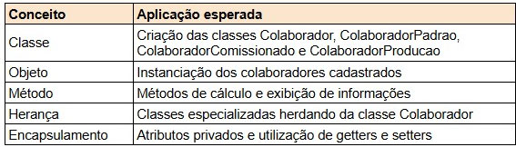

# CalculoFolhaPagamento
Projeto do 2ª Semestre da faculdade de CC, desenvolvido em java com o objeto de de realizar o calculo da folha de pagamento dos funcionários 

O objetivo é criar um programa que permita cadastrar colaboradores e calcular o salário final de acordo com o tipo de vínculo. O sistema deverá ser interativo, utilizando entrada e saída de dados, estruturas de decisão, laços de repetição, estruturas de seleção e armazenamento de informações em listas (ArrayList).

Conceitos estudados nesta UC que deverão ser aplicados:

Criar e instanciar objetos.
Definir e utilizar classes.
Implementar métodos para processamento de informações.
Aplicar herança para especialização de classes.
Utilizar encapsulamento por meio de atributos privados e métodos de acesso.
Manipular coleções utilizando ArrayList.
Construir menus interativos utilizando estruturas de repetição e seleção.

Aplicação dos Conceitos de POO

